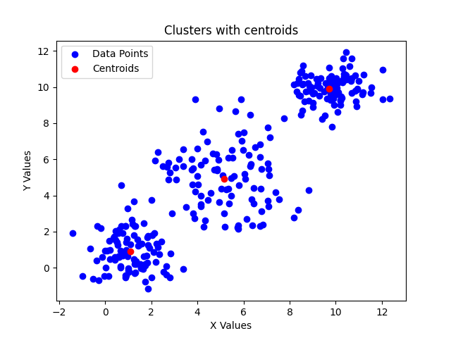

## About

Implementation of basic k-means clustering algorithm using Rust. Pseudocode:

```
k_means(D, k, eps):
    # Randomly initialize centroids (c_1(t), ... , c_k(t))
    repeat:
        t <- t + 1
        C_i <- ∅
        // Cluster update step:
        ∀i ∈ [1:k]: C_i = { x ∈ D | d(x, c_i(t - 1)) = min_j d(x, c_j(t - 1)) }
        // Centroid update step:
        c_i(t) := centroid(C_i)
    until sum_i^k d(c_i(t), c_(t-1)) < eps
```

Here `centroid(C)` is the sum of all vectors in `D` divided by
the cardinality of `D` (center of mass).

## How to run

From within the project's root folder run:

```
cargo run -- -i example/dataset.csv -o output -k 3
```


